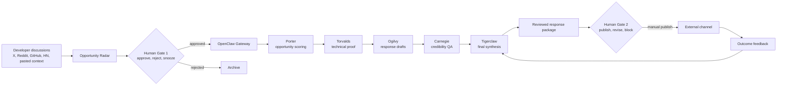

# GTM Agentic OS

GTM Agentic OS is a human-gated multi-agent workflow for turning developer market signals into reviewed, technical GTM response packages.

The current demo uses BAML / BoundaryML as the target product wedge: it watches for developer pain around structured outputs, brittle JSON parsing, prompt testing, provider switching, and AI workflow reliability, then routes approved opportunities through a specialist agent chain.

**Prototype demo:** https://baml-gtm-agentic-os.vercel.app/

## What It Does

1. Collects developer discussions from seeded cases or pasted context.
2. Scores whether the opportunity is worth engaging with.
3. Builds a technical proof instead of generic marketing copy.
4. Drafts channel-native responses for X, HN, Reddit, GitHub, or DevRel follow-up.
5. Runs credibility and spam-risk QA.
6. Produces a final human-reviewed response package.
7. Records outcome feedback so future scoring and drafts can improve.

The system does **not** auto-post. A human approves opportunities before agent execution and reviews the final package before publishing anywhere.

## Why This Exists

Most GTM workflows treat AI as a copy generator. This repo treats GTM as an agentic operating system:

- **Signal detection:** identify developer pain that is specific enough to respond to.
- **Human gates:** prevent spam, weak-fit outreach, and unreviewed automation.
- **Technical proof:** answer the actual engineering complaint before mentioning the product.
- **Specialist routing:** split scoring, proof, drafting, QA, and synthesis across focused agents.
- **Outcome loops:** evaluate whether the response worked and feed that back into future missions.

## Architecture



## Agent Chain

| Agent | Role | Output |
| --- | --- | --- |
| Curie | Opportunity radar | Candidate card with source, detected pain, relevance, confidence, and suggested angle |
| Porter | Opportunity scorer | ICP fit, urgency, channel fit, risk, and engage / revise / block recommendation |
| Torvalds | Technical proof builder | Concrete explanation of the developer pain and a useful before / after framing |
| Ogilvy | Response drafter | Channel-native drafts for X, HN / Reddit, GitHub, DevRel DM, and CTA |
| Carnegie | Credibility QA | Spam-risk review, factual discipline, tone check, and final polish |
| Tigerclaw | Orchestrator / evaluator | Final package, approval recommendation, score breakdown, and outcome learning |

Agent harnesses live in `squad/baml-gtm/`. OpenClaw Gateway loads those files as role contracts, routes context across the chain, and records handoffs in Convex.

## Core Components

- `app/` - Next.js UI for radar, mission queue, activity feed, and mission review.
- `convex/` - task state, activity logs, backend functions, and hosted demo actions.
- `gateway/` - OpenClaw Gateway runtime for local agent execution.
- `lib/bamlGtmDemo.ts` - demo opportunities, objective, and agent manifest.
- `lib/bamlGtmPackage.ts` - deterministic hosted-demo package generator.
- `squad/baml-gtm/` - specialist agent harnesses.

## Runtime Modes

### Hosted Demo Mode

Use this for public demos or reviewers.

```text
candidate -> human approval -> hosted package generator -> completed GTM opportunity package
```

Set:

```text
NEXT_PUBLIC_HOSTED_DEMO=true
CONVEX_DEPLOY_KEY=<your Convex production deploy key>
```

Hosted mode does not require local daemons, ChatGPT auth, OpenAI keys, live scraping, or auto-posting.

### Local Gateway Mode

Use this for the full OpenClaw runtime.

```text
candidate -> human approval -> OpenClaw Gateway -> Porter -> Torvalds -> Ogilvy -> Carnegie -> Tigerclaw
```

Set `NEXT_PUBLIC_HOSTED_DEMO=false` or omit it, then run the gateway locally.

## Local Run

```bash
npm install
npx convex dev --local --local-force-upgrade --typecheck disable
npm run dev -- --port 3001
```

In another terminal, run the gateway dispatcher when using local gateway mode:

```bash
npm run gateway:dispatcher
```

You can also launch the full stack with:

```bash
./start.sh --detach
```

## Deployment

The repo includes `vercel.json`, which deploys Convex before the Next.js build:

```bash
npx convex deploy --cmd-url-env-var-name NEXT_PUBLIC_CONVEX_URL --cmd 'npm run build'
```

Recommended public-demo setup:

1. Create a Convex project.
2. Import this repo into Vercel.
3. Add `CONVEX_DEPLOY_KEY` and `NEXT_PUBLIC_HOSTED_DEMO=true`.
4. Deploy from Vercel.
5. Open the app, approve a seeded opportunity, and inspect the completed response package.

## Safety Boundaries

- No auto-posting.
- No hidden commercial intent.
- No pretending seeded demo inputs are live scraped platform data.
- No unsupported product claims or fake benchmarks.
- No mass outreach automation.

## Status

This is a focused applied-AI build: a GTM operating system pattern using OpenClaw Gateway, Convex, Next.js, and specialist agent harnesses.
